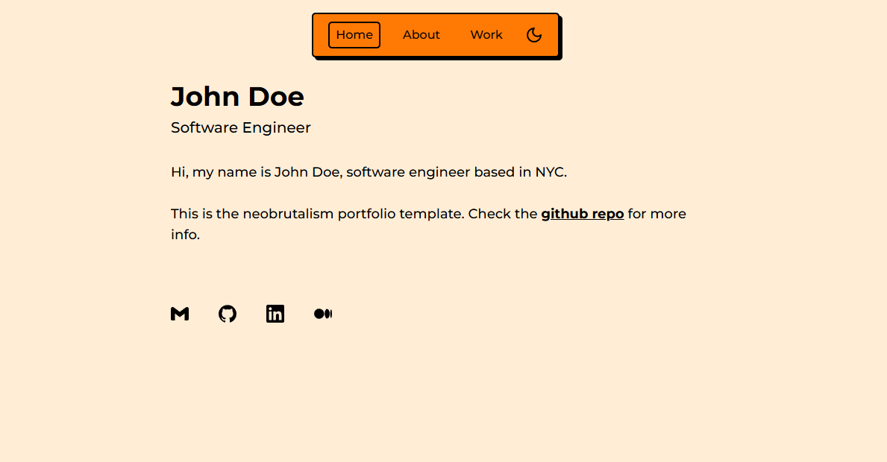

# Portfolio

Portfolio is a neobrutalism-styled nextjs tailwind template for portfolios.

## Get started

[Create a new repo](https://github.com/neobrutalism-templates/portfolio/generate) from this template.

### Installation

This template uses `pnpm` package manager so make sure you have it installed.

To install all dependencies run:

```bash
pnpm i
```

To run the app locally:

```bash
pnpm run dev
```

### Config

- Inside `layout.tsx` update the metadata
- Inside `page.tsx` update the content
- Update the `favicon.ico`

### Content config

#### Links on the home page

To update the links on the home page go to `src/components/links.tsx` and inside `links` array add or remove objects. Each object has 2 properties, `icon`, and `href`. `href` is self-explanatory, and inside `icon` you'll put an icon imported from `@icons-pack/react-simple-icons`. Visit [simpleicons.org](https://simpleicons.org/) to see all the icons. Import them by adding `Si` prefix to their name as I imported them in `links` component.

#### Updating the rest of the content

Inside `data` folder you have the rest of the content you can edit.

#### Updating skills

I need to clarify how to edit skills since it looks confusing at first. Inside the `skills.ts` inside the `SKILLS` array, each object in the array is a field of skills (can be anything: frontend, backend, devops, design etc). Each object has a `field` prop which is the field name. Also, each object has a `skills` array where each array member has a `skill` value (used as tooltip value), and `icon` is the icon that will be displayed.
You update them the same way you'd update links on the home page.

### Styling

To change the styling visit [styling docs](https://neobrutalism-components.vercel.app/docs/styling), and copy the desired styling to tailwind config like it's shown in the styling docs.
